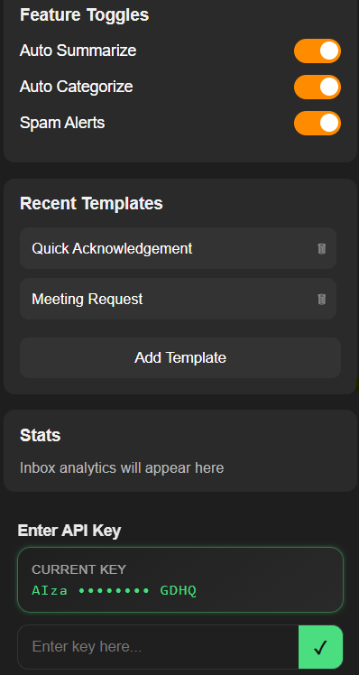
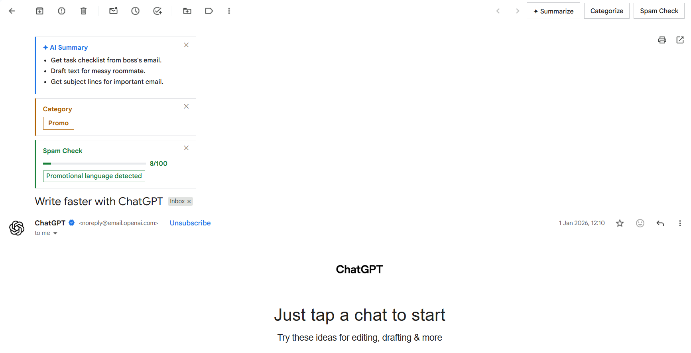
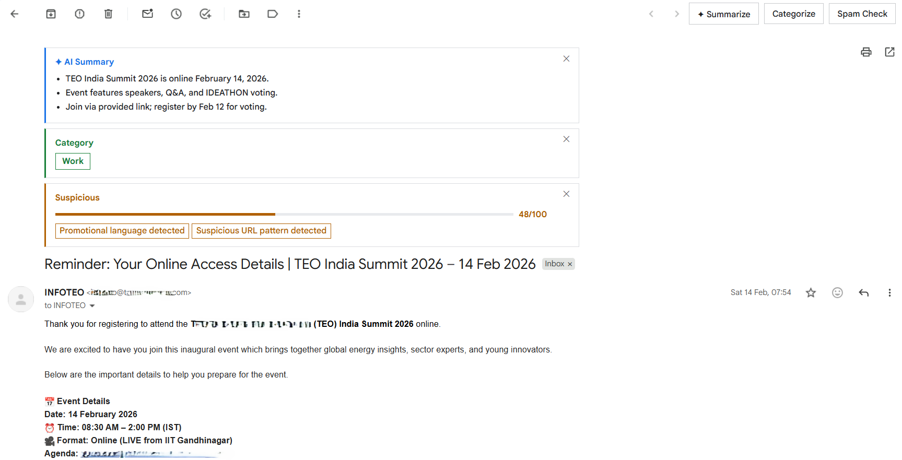
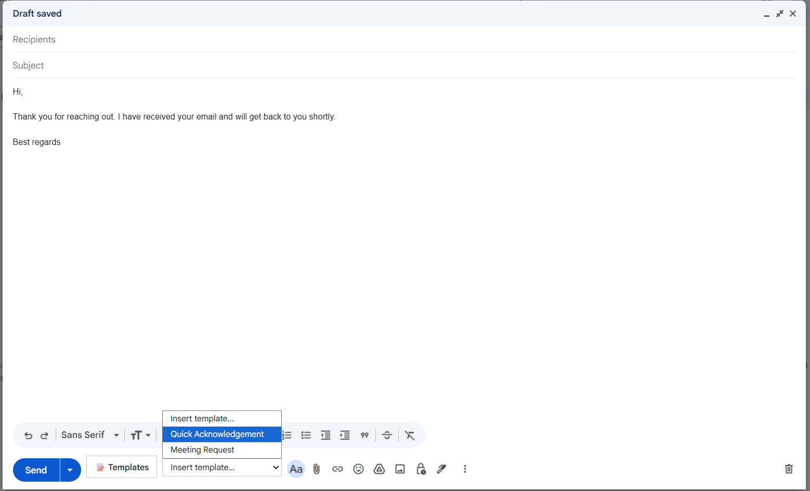
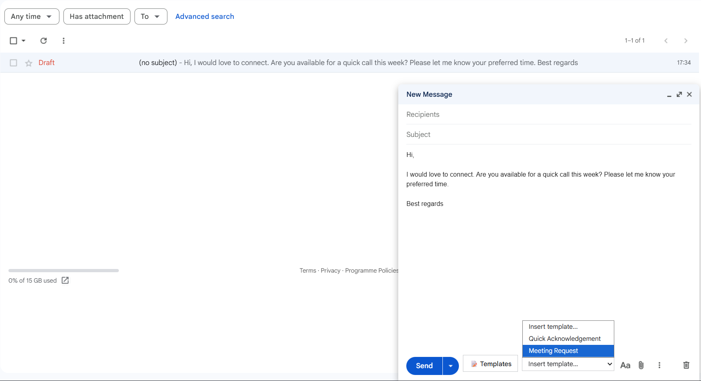

# InboxZero AI

> A Chrome extension designed to enhance your browsing experience and improve productivity.

---

## 📦 Requirements

Before installing, make sure you have:

- Google Chrome (latest version recommended) or any other chromium browser
- Internet connection (required by the extension for summarization and categorization)

---

## 🚀 Installation

### 1️⃣ Download the Extension

1. Go to the **Releases** page of https://github.com/Jay-Jay-Tee/gmail-chrome-extension.git.
2. Download the latest `.zip` file from the **Assets** section.
3. Extract the ZIP file to a folder on your computer.

---

### 2️⃣ Load the Extension in Chrome (Load Unpacked Method)

1. Open **Google Chrome** (or any other browser).
2. Open sidebar and click on extensions.
3. Enable **Developer mode** (toggle in the top-right corner).
4. Click **Load unpacked**.
5. Select the extracted project folder (not the ZIP file).
6. The extension will now be installed and visible in your extensions list.

---

## 🔄 Updating

To update the extension:

1. Download the latest version from the **Releases** page.
2. Extract the new ZIP file.
3. Open `chrome://extensions/`.
4. Click **Remove** on the old version.
5. Click **Load unpacked** and select the new folder.

---

## 🛠 Usage

1. Click the extension icon in the Chrome toolbar.
2. Configure settings if available.
3. Start using the extension.

---

## 🐞 Troubleshooting

- Ensure **Developer mode** is enabled.
- Make sure you selected the extracted folder, not the ZIP file.
- If errors appear, check the error message shown in `chrome://extensions/`.

---

## Reference screenshots

### Popup

### Promotional message identification

### Possible spam messages, still with summary

### Template applying

## 📜 License

MIT License

Copyright (c) 2026 H R Soorya Dev 
Copyright (c) 2026 Joshua Jacob Thomas  
Copyright (c) 2026 Siddharth Madhavan

Permission is hereby granted, free of charge, to any person obtaining a copy
of this software and associated documentation files (the "Software"), to deal
in the Software without restriction, including without limitation the rights
to use, copy, modify, merge, publish, distribute, sublicense, and/or sell
copies of the Software, and to permit persons to whom the Software is
furnished to do so, subject to the following conditions:

The above copyright notice and this permission notice shall be included in all
copies or substantial portions of the Software.

THE SOFTWARE IS PROVIDED "AS IS", WITHOUT WARRANTY OF ANY KIND, EXPRESS OR
IMPLIED, INCLUDING BUT NOT LIMITED TO THE WARRANTIES OF MERCHANTABILITY,
FITNESS FOR A PARTICULAR PURPOSE AND NONINFRINGEMENT. IN NO EVENT SHALL THE
AUTHORS OR COPYRIGHT HOLDERS BE LIABLE FOR ANY CLAIM, DAMAGES OR OTHER
LIABILITY, WHETHER IN AN ACTION OF CONTRACT, TORT OR OTHERWISE, ARISING FROM,
OUT OF OR IN CONNECTION WITH THE SOFTWARE OR THE USE OR OTHER DEALINGS IN THE
SOFTWARE.
